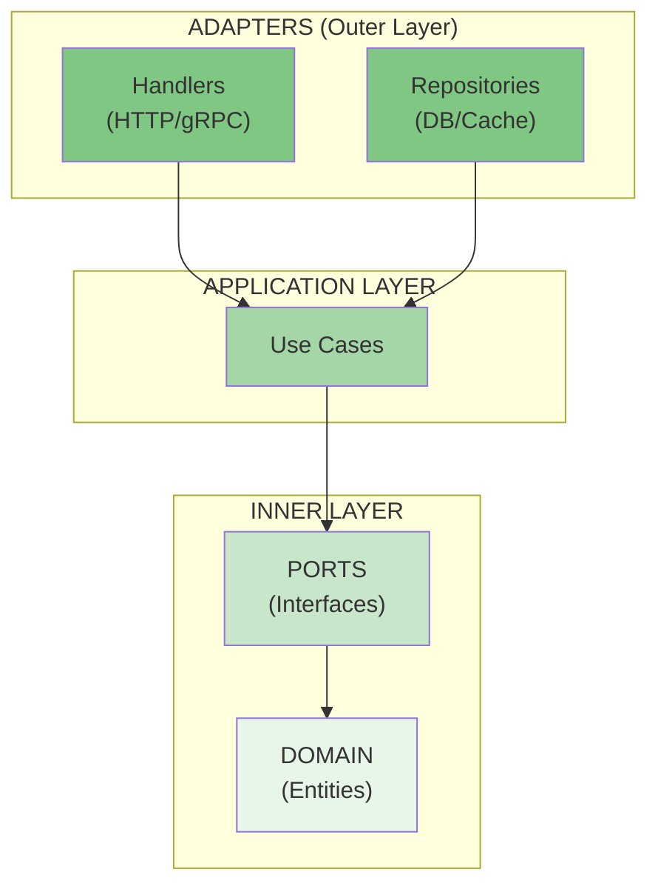

# Hexagonal Architecture for Go

This document defines the mandatory architectural patterns for all Go projects.

## Overview

Hexagonal Architecture (also called Ports and Adapters or Onion Architecture) separates business logic from infrastructure concerns through clear boundaries and dependency inversion.



**Key principle**: Dependencies flow INWARD. Domain has no external dependencies.

## Project Structure

```
project/
├── cmd/                          # Composition root
│   └── myapp/
│       ├── main.go               # Entry point, wiring
│       └── root.go               # Cobra root command (if CLI)
├── internal/
│   ├── domain/                   # INNER: Pure business logic
│   │   ├── entities.go           # Business objects
│   │   └── errors.go             # Domain errors
│   ├── ports/                    # INNER: Interface contracts
│   │   ├── repositories.go
│   │   └── services.go
│   ├── application/              # APPLICATION: Use cases
│   │   └── services.go
│   └── adapters/                 # OUTER: Infrastructure
│       ├── handlers/             # HTTP/gRPC (primary/driving)
│       └── repositories/         # Database (secondary/driven)
├── pkg/                          # Reusable library code
├── api/                          # API definitions (proto, OpenAPI)
├── .go-arch-lint.yml             # Architecture enforcement
├── .golangci.yml                 # Linting rules
├── Taskfile.yml                  # Build targets (required)
└── go.mod
```

## Layer Definitions

### Domain Layer (`internal/domain/`)

The innermost layer containing business entities and rules.

**Contains:**
- Entities (business objects with identity)
- Value objects (immutable, no identity)
- Domain errors
- Domain events

**Rules:**
- NO external dependencies (no database, no HTTP, no frameworks)
- Only Go standard library types
- Pure business logic

**Example:**

```go
// internal/domain/user.go
package domain

import (
    "errors"
    "time"
)

// Domain errors - define here, not in adapters
var (
    ErrUserNotFound     = errors.New("user not found")
    ErrInvalidEmail     = errors.New("invalid email format")
    ErrDuplicateEmail   = errors.New("email already exists")
)

// User is a domain entity
type User struct {
    ID        string
    Email     string
    Name      string
    CreatedAt time.Time
    UpdatedAt time.Time
}

// NewUser creates a new user with validation
func NewUser(email, name string) (*User, error) {
    if !isValidEmail(email) {
        return nil, ErrInvalidEmail
    }
    return &User{
        Email:     email,
        Name:      name,
        CreatedAt: time.Now(),
        UpdatedAt: time.Now(),
    }, nil
}

// Domain behavior belongs on the entity
func (u *User) UpdateName(name string) {
    u.Name = name
    u.UpdatedAt = time.Now()
}

func isValidEmail(email string) bool {
    // Simple validation - domain logic
    return len(email) > 3 && contains(email, "@")
}

func contains(s, substr string) bool {
    for i := 0; i <= len(s)-len(substr); i++ {
        if s[i:i+len(substr)] == substr {
            return true
        }
    }
    return false
}
```

### Ports Layer (`internal/ports/`)

Interfaces that define contracts between layers.

**Contains:**
- Repository interfaces (for data access)
- Service interfaces (for use cases)
- External service interfaces

**Rules:**
- Only interfaces, no implementations
- Only depend on domain types
- Define what the application needs, not what adapters provide

**Example:**

```go
// internal/ports/repositories.go
package ports

import (
    "context"

    "myapp/internal/domain"
)

// UserRepository defines data access for users
type UserRepository interface {
    Save(ctx context.Context, user *domain.User) error
    FindByID(ctx context.Context, id string) (*domain.User, error)
    FindByEmail(ctx context.Context, email string) (*domain.User, error)
    Delete(ctx context.Context, id string) error
}

// UnitOfWork for transaction management
type UnitOfWork interface {
    Begin(ctx context.Context) (context.Context, error)
    Commit(ctx context.Context) error
    Rollback(ctx context.Context) error
}
```

```go
// internal/ports/services.go
package ports

import (
    "context"

    "myapp/internal/domain"
)

// UserService defines business operations
type UserService interface {
    CreateUser(ctx context.Context, email, name string) (*domain.User, error)
    GetUser(ctx context.Context, id string) (*domain.User, error)
    UpdateUser(ctx context.Context, id, name string) (*domain.User, error)
    DeleteUser(ctx context.Context, id string) error
}
```

### Application Layer (`internal/application/`)

Application logic / use cases that orchestrate domain objects.

**Contains:**
- Use case implementations
- Business workflows
- Transaction orchestration

**Rules:**
- Depend on ports (interfaces), not concrete implementations
- Depend on domain types
- NO direct database or HTTP code

**Example:**

```go
// internal/application/user_service.go
package application

import (
    "context"
    "fmt"

    "myapp/internal/domain"
    "myapp/internal/ports"
)

type userService struct {
    repo ports.UserRepository
}

// NewUserService creates a new user service
func NewUserService(repo ports.UserRepository) ports.UserService {
    return &userService{repo: repo}
}

func (s *userService) CreateUser(ctx context.Context, email, name string) (*domain.User, error) {
    // Check for duplicate
    existing, err := s.repo.FindByEmail(ctx, email)
    if err != nil && err != domain.ErrUserNotFound {
        return nil, fmt.Errorf("check existing user: %w", err)
    }
    if existing != nil {
        return nil, domain.ErrDuplicateEmail
    }

    // Create domain entity (includes validation)
    user, err := domain.NewUser(email, name)
    if err != nil {
        return nil, fmt.Errorf("create user: %w", err)
    }

    // Persist
    if err := s.repo.Save(ctx, user); err != nil {
        return nil, fmt.Errorf("save user: %w", err)
    }

    return user, nil
}

func (s *userService) GetUser(ctx context.Context, id string) (*domain.User, error) {
    user, err := s.repo.FindByID(ctx, id)
    if err != nil {
        return nil, fmt.Errorf("find user: %w", err)
    }
    return user, nil
}

func (s *userService) UpdateUser(ctx context.Context, id, name string) (*domain.User, error) {
    user, err := s.repo.FindByID(ctx, id)
    if err != nil {
        return nil, fmt.Errorf("find user: %w", err)
    }

    user.UpdateName(name)

    if err := s.repo.Save(ctx, user); err != nil {
        return nil, fmt.Errorf("save user: %w", err)
    }

    return user, nil
}

func (s *userService) DeleteUser(ctx context.Context, id string) error {
    if err := s.repo.Delete(ctx, id); err != nil {
        return fmt.Errorf("delete user: %w", err)
    }
    return nil
}
```

### Adapters Layer (`internal/adapters/`)

Concrete implementations of ports.

#### Handlers (`internal/adapters/handlers/`)

Primary/Driving adapters - entry points to the application.

**Example:**

```go
// internal/adapters/handlers/http/user_handler.go
package http

import (
    "encoding/json"
    "errors"
    "net/http"

    "myapp/internal/domain"
    "myapp/internal/ports"
)

type UserHandler struct {
    service ports.UserService
}

func NewUserHandler(service ports.UserService) *UserHandler {
    return &UserHandler{service: service}
}

type createUserRequest struct {
    Email string `json:"email"`
    Name  string `json:"name"`
}

type userResponse struct {
    ID    string `json:"id"`
    Email string `json:"email"`
    Name  string `json:"name"`
}

func (h *UserHandler) CreateUser(w http.ResponseWriter, r *http.Request) {
    var req createUserRequest
    if err := json.NewDecoder(r.Body).Decode(&req); err != nil {
        http.Error(w, "invalid request body", http.StatusBadRequest)
        return
    }

    user, err := h.service.CreateUser(r.Context(), req.Email, req.Name)
    if err != nil {
        h.handleError(w, err)
        return
    }

    w.Header().Set("Content-Type", "application/json")
    w.WriteHeader(http.StatusCreated)
    json.NewEncoder(w).Encode(userResponse{
        ID:    user.ID,
        Email: user.Email,
        Name:  user.Name,
    })
}

func (h *UserHandler) handleError(w http.ResponseWriter, err error) {
    switch {
    case errors.Is(err, domain.ErrUserNotFound):
        http.Error(w, err.Error(), http.StatusNotFound)
    case errors.Is(err, domain.ErrInvalidEmail):
        http.Error(w, err.Error(), http.StatusBadRequest)
    case errors.Is(err, domain.ErrDuplicateEmail):
        http.Error(w, err.Error(), http.StatusConflict)
    default:
        http.Error(w, "internal server error", http.StatusInternalServerError)
    }
}
```

#### Repositories (`internal/adapters/repositories/`)

Secondary/Driven adapters - external dependencies.

**Example:**

```go
// internal/adapters/repositories/postgres/user_repository.go
package postgres

import (
    "context"
    "database/sql"
    "errors"
    "fmt"

    "github.com/google/uuid"

    "myapp/internal/domain"
    "myapp/internal/ports"
)

type userRepository struct {
    db *sql.DB
}

// NewUserRepository creates a new PostgreSQL user repository
func NewUserRepository(db *sql.DB) ports.UserRepository {
    return &userRepository{db: db}
}

func (r *userRepository) Save(ctx context.Context, user *domain.User) error {
    if user.ID == "" {
        user.ID = uuid.New().String()
    }

    query := `
        INSERT INTO users (id, email, name, created_at, updated_at)
        VALUES ($1, $2, $3, $4, $5)
        ON CONFLICT (id) DO UPDATE SET
            name = EXCLUDED.name,
            updated_at = EXCLUDED.updated_at
    `

    _, err := r.db.ExecContext(ctx, query,
        user.ID, user.Email, user.Name, user.CreatedAt, user.UpdatedAt)
    if err != nil {
        return fmt.Errorf("save user: %w", err)
    }

    return nil
}

func (r *userRepository) FindByID(ctx context.Context, id string) (*domain.User, error) {
    query := `SELECT id, email, name, created_at, updated_at FROM users WHERE id = $1`

    var user domain.User
    err := r.db.QueryRowContext(ctx, query, id).Scan(
        &user.ID, &user.Email, &user.Name, &user.CreatedAt, &user.UpdatedAt)
    if errors.Is(err, sql.ErrNoRows) {
        return nil, domain.ErrUserNotFound
    }
    if err != nil {
        return nil, fmt.Errorf("find user by id: %w", err)
    }

    return &user, nil
}

func (r *userRepository) FindByEmail(ctx context.Context, email string) (*domain.User, error) {
    query := `SELECT id, email, name, created_at, updated_at FROM users WHERE email = $1`

    var user domain.User
    err := r.db.QueryRowContext(ctx, query, email).Scan(
        &user.ID, &user.Email, &user.Name, &user.CreatedAt, &user.UpdatedAt)
    if errors.Is(err, sql.ErrNoRows) {
        return nil, domain.ErrUserNotFound
    }
    if err != nil {
        return nil, fmt.Errorf("find user by email: %w", err)
    }

    return &user, nil
}

func (r *userRepository) Delete(ctx context.Context, id string) error {
    query := `DELETE FROM users WHERE id = $1`

    result, err := r.db.ExecContext(ctx, query, id)
    if err != nil {
        return fmt.Errorf("delete user: %w", err)
    }

    rows, err := result.RowsAffected()
    if err != nil {
        return fmt.Errorf("check rows affected: %w", err)
    }
    if rows == 0 {
        return domain.ErrUserNotFound
    }

    return nil
}
```

### Main / Wiring (`cmd/`)

Dependency injection and application bootstrap. Uses Cobra/Viper for CLI.

**Example:**

```go
// cmd/myapp/main.go
package main

import (
    "os"

    "github.com/spf13/cobra"
    "github.com/spf13/viper"
)

func main() {
    if err := rootCmd.Execute(); err != nil {
        os.Exit(1)
    }
}

// cmd/myapp/root.go
var rootCmd = &cobra.Command{
    Use:   "myapp",
    Short: "My application",
}

func init() {
    cobra.OnInitialize(initConfig)
    rootCmd.PersistentFlags().String("config", "", "config file")
    viper.BindPFlag("config", rootCmd.PersistentFlags().Lookup("config"))
}

func initConfig() {
    if cfgFile := viper.GetString("config"); cfgFile != "" {
        viper.SetConfigFile(cfgFile)
    }
    viper.AutomaticEnv()
    viper.ReadInConfig()
}

// cmd/myapp/serve.go
var serveCmd = &cobra.Command{
    Use:   "serve",
    Short: "Start the server",
    RunE:  runServe,
}

func init() {
    serveCmd.Flags().Int("port", 8080, "server port")
    viper.BindPFlag("port", serveCmd.Flags().Lookup("port"))
    rootCmd.AddCommand(serveCmd)
}

func runServe(cmd *cobra.Command, args []string) error {
    // Wire dependencies
    db, err := sql.Open("postgres", viper.GetString("database_url"))
    if err != nil {
        return err
    }
    defer db.Close()

    userRepo := postgres.NewUserRepository(db)
    userService := application.NewUserService(userRepo)
    userHandler := httphandler.NewUserHandler(userService)

    // Routes
    mux := http.NewServeMux()
    mux.HandleFunc("POST /users", userHandler.CreateUser)
    mux.HandleFunc("GET /users/{id}", userHandler.GetUser)

    // Start server
    addr := fmt.Sprintf(":%d", viper.GetInt("port"))
    return http.ListenAndServe(addr, mux)
}
```

## Dependency Rules

| Layer | Can Import | Cannot Import |
|-------|------------|---------------|
| Domain | (nothing external) | adapters, application, ports |
| Ports | domain | adapters, application |
| Application | domain, ports | adapters |
| Adapters | domain, ports | application (usually) |
| Cmd | everything | - |

## Testing Strategy

### Unit Tests (Domain & Application)

Test business logic in isolation using testify.

```go
// internal/application/user_service_test.go
package application_test

import (
    "context"
    "testing"

    "github.com/stretchr/testify/assert"
    "github.com/stretchr/testify/require"

    "myapp/internal/application"
    "myapp/internal/domain"
)

type mockUserRepo struct {
    users map[string]*domain.User
}

func newMockUserRepo() *mockUserRepo {
    return &mockUserRepo{users: make(map[string]*domain.User)}
}

func (m *mockUserRepo) Save(ctx context.Context, user *domain.User) error {
    m.users[user.ID] = user
    return nil
}

func (m *mockUserRepo) FindByID(ctx context.Context, id string) (*domain.User, error) {
    if user, ok := m.users[id]; ok {
        return user, nil
    }
    return nil, domain.ErrUserNotFound
}

func (m *mockUserRepo) FindByEmail(ctx context.Context, email string) (*domain.User, error) {
    for _, user := range m.users {
        if user.Email == email {
            return user, nil
        }
    }
    return nil, domain.ErrUserNotFound
}

func (m *mockUserRepo) Delete(ctx context.Context, id string) error {
    delete(m.users, id)
    return nil
}

func TestUserService_CreateUser(t *testing.T) {
    repo := newMockUserRepo()
    svc := application.NewUserService(repo)

    user, err := svc.CreateUser(context.Background(), "test@example.com", "Test User")

    require.NoError(t, err)
    assert.Equal(t, "test@example.com", user.Email)
}

func TestUserService_CreateUser_DuplicateEmail(t *testing.T) {
    repo := newMockUserRepo()
    svc := application.NewUserService(repo)

    // Create first user
    _, err := svc.CreateUser(context.Background(), "test@example.com", "Test User")
    require.NoError(t, err)

    // Try to create duplicate
    _, err = svc.CreateUser(context.Background(), "test@example.com", "Another User")
    assert.ErrorIs(t, err, domain.ErrDuplicateEmail)
}
```

### Integration Tests (Adapters)

Test infrastructure code with real dependencies.

```go
// internal/adapters/repositories/postgres/user_repository_test.go
//go:build integration

package postgres_test

import (
    "context"
    "database/sql"
    "testing"

    _ "github.com/lib/pq"
    "github.com/stretchr/testify/assert"
    "github.com/stretchr/testify/require"

    "myapp/internal/adapters/repositories/postgres"
    "myapp/internal/domain"
)

func setupTestDB(t *testing.T) *sql.DB {
    db, err := sql.Open("postgres", "postgres://localhost/myapp_test?sslmode=disable")
    require.NoError(t, err, "failed to connect to test database")
    return db
}

func TestUserRepository_Save_and_FindByID(t *testing.T) {
    db := setupTestDB(t)
    defer db.Close()

    repo := postgres.NewUserRepository(db)

    user, err := domain.NewUser("test@example.com", "Test User")
    require.NoError(t, err)
    user.ID = "test-id-123"

    err = repo.Save(context.Background(), user)
    require.NoError(t, err)

    found, err := repo.FindByID(context.Background(), "test-id-123")
    require.NoError(t, err)
    assert.Equal(t, user.Email, found.Email)
}
```

## Common Mistakes to Avoid

1. **Domain importing adapters**
   ```go
   // BAD: Domain should not know about HTTP
   package domain
   import "net/http"
   ```

2. **Services using concrete implementations**
   ```go
   // BAD: Depends on concrete type
   func NewUserService(repo *postgres.UserRepository) { }

   // GOOD: Depends on interface
   func NewUserService(repo ports.UserRepository) { }
   ```

3. **Business logic in handlers**
   ```go
   // BAD: Validation in handler
   func (h *Handler) CreateUser(w http.ResponseWriter, r *http.Request) {
       if !isValidEmail(req.Email) { ... }  // Should be in domain/service
   }
   ```

4. **Database types in domain**
   ```go
   // BAD: sql.NullString in domain
   package domain
   type User struct {
       Name sql.NullString  // Database concern leaked into domain
   }
   ```

## Verification Commands

```bash
# Use Taskfile targets (required)
task build
task test
task lint

# Check architecture rules
go-arch-lint check

# Visualize dependencies
go-arch-lint graph
```
