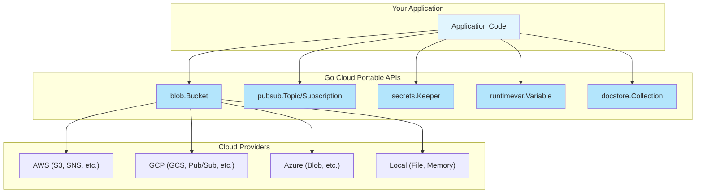

# Go Cloud SDK Patterns

The Go Cloud Development Kit (https://gocloud.dev/) provides portable Cloud APIs. Follow these patterns to build reusable, cloud-agnostic components.

## Core Concepts

### Portable Types

Go Cloud provides portable types that work across cloud providers:



### URL-Based Construction

Open resources using URLs for configuration-driven initialization:

```go
import (
    "context"
    "gocloud.dev/blob"
    _ "gocloud.dev/blob/s3blob"    // Register S3 driver
    _ "gocloud.dev/blob/gcsblob"   // Register GCS driver
    _ "gocloud.dev/blob/fileblob"  // Register file driver
)

func NewStorage(ctx context.Context, bucketURL string) (*blob.Bucket, error) {
    // URL determines provider:
    // "s3://my-bucket"       -> AWS S3
    // "gs://my-bucket"       -> Google Cloud Storage
    // "file:///tmp/bucket"   -> Local filesystem
    return blob.OpenBucket(ctx, bucketURL)
}
```

---

## Applying Go Cloud Patterns

### 1. Define Portable Interfaces

Follow Go Cloud's pattern of defining portable interfaces in your domain:

```go
// internal/ports/storage.go
package ports

import (
    "context"
    "io"
)

// ObjectStorage provides portable object storage operations
type ObjectStorage interface {
    // Read reads an object by key
    Read(ctx context.Context, key string) (io.ReadCloser, error)

    // Write writes data to an object
    Write(ctx context.Context, key string, r io.Reader, opts *WriteOptions) error

    // Delete removes an object
    Delete(ctx context.Context, key string) error

    // List lists objects with a prefix
    List(ctx context.Context, prefix string) ([]ObjectInfo, error)

    // SignedURL returns a signed URL for direct access
    SignedURL(ctx context.Context, key string, opts *SignedURLOptions) (string, error)
}

type WriteOptions struct {
    ContentType string
    Metadata    map[string]string
}

type SignedURLOptions struct {
    Expiry time.Duration
    Method string // "GET" or "PUT"
}

type ObjectInfo struct {
    Key     string
    Size    int64
    ModTime time.Time
}
```

### 2. Implement with Go Cloud

```go
// internal/adapters/storage/gocloud/storage.go
package gocloud

import (
    "context"
    "fmt"
    "io"

    "gocloud.dev/blob"
    _ "gocloud.dev/blob/fileblob"
    _ "gocloud.dev/blob/gcsblob"
    _ "gocloud.dev/blob/s3blob"

    "myapp/internal/ports"
)

type storage struct {
    bucket *blob.Bucket
}

// NewStorage creates a portable storage from a URL
func NewStorage(ctx context.Context, bucketURL string) (ports.ObjectStorage, error) {
    bucket, err := blob.OpenBucket(ctx, bucketURL)
    if err != nil {
        return nil, fmt.Errorf("open bucket %s: %w", bucketURL, err)
    }
    return &storage{bucket: bucket}, nil
}

func (s *storage) Read(ctx context.Context, key string) (io.ReadCloser, error) {
    return s.bucket.NewReader(ctx, key, nil)
}

func (s *storage) Write(ctx context.Context, key string, r io.Reader, opts *ports.WriteOptions) error {
    wopts := &blob.WriterOptions{}
    if opts != nil {
        wopts.ContentType = opts.ContentType
        wopts.Metadata = opts.Metadata
    }

    w, err := s.bucket.NewWriter(ctx, key, wopts)
    if err != nil {
        return fmt.Errorf("create writer: %w", err)
    }

    if _, err := io.Copy(w, r); err != nil {
        w.Close()
        return fmt.Errorf("write data: %w", err)
    }

    return w.Close()
}

func (s *storage) Delete(ctx context.Context, key string) error {
    return s.bucket.Delete(ctx, key)
}

func (s *storage) List(ctx context.Context, prefix string) ([]ports.ObjectInfo, error) {
    var objects []ports.ObjectInfo
    iter := s.bucket.List(&blob.ListOptions{Prefix: prefix})

    for {
        obj, err := iter.Next(ctx)
        if err == io.EOF {
            break
        }
        if err != nil {
            return nil, fmt.Errorf("list objects: %w", err)
        }
        objects = append(objects, ports.ObjectInfo{
            Key:     obj.Key,
            Size:    obj.Size,
            ModTime: obj.ModTime,
        })
    }

    return objects, nil
}

func (s *storage) Close() error {
    return s.bucket.Close()
}
```

### 3. Configuration-Driven Wiring

```go
// cmd/myapp/main.go
package main

import (
    "context"
    "log"
    "os"

    "myapp/internal/adapters/storage/gocloud"
    "myapp/internal/application"
)

func main() {
    ctx := context.Background()

    // Configuration determines provider
    storageURL := os.Getenv("STORAGE_URL")
    if storageURL == "" {
        storageURL = "file:///tmp/myapp-storage"  // Local default
    }

    storage, err := gocloud.NewStorage(ctx, storageURL)
    if err != nil {
        log.Fatal(err)
    }
    defer storage.Close()

    // Application uses portable interface
    service := application.NewDocumentService(storage)
    // ...
}
```

---

## Go Cloud Services Reference

| Service | Package | URL Schemes |
|---------|---------|-------------|
| Blob Storage | `gocloud.dev/blob` | `s3://`, `gs://`, `azblob://`, `file://` |
| Pub/Sub | `gocloud.dev/pubsub` | `awssns://`, `gcppubsub://`, `azuresb://`, `mem://` |
| Secrets | `gocloud.dev/secrets` | `awskms://`, `gcpkms://`, `azurekeyvault://` |
| Runtime Config | `gocloud.dev/runtimevar` | `awsparamstore://`, `gcpruntimeconfig://` |
| Document Store | `gocloud.dev/docstore` | `dynamodb://`, `firestore://`, `mongo://` |
| MySQL/PostgreSQL | `gocloud.dev/mysql`, `gocloud.dev/postgres` | Cloud SQL, RDS URLs |

---

## Design Principles

### 1. Program Against Interfaces

```go
// GOOD: Depend on portable interface
type DocumentService struct {
    storage ports.ObjectStorage
}

// BAD: Depend on concrete provider
type DocumentService struct {
    s3Client *s3.Client
}
```

### 2. URL-Based Configuration

```go
// GOOD: URL-based, environment-configurable
bucket, _ := blob.OpenBucket(ctx, os.Getenv("BUCKET_URL"))

// BAD: Hard-coded provider
sess := session.Must(session.NewSession())
bucket := s3blob.OpenBucket(ctx, sess, "my-bucket", nil)
```

### 3. Local Development Support

Always support local alternatives for development:

```go
func getStorageURL() string {
    if url := os.Getenv("STORAGE_URL"); url != "" {
        return url
    }
    // Default to local filesystem for development
    return "file:///tmp/local-storage"
}
```

### 4. Graceful Cleanup

```go
type App struct {
    bucket *blob.Bucket
    topic  *pubsub.Topic
}

func (a *App) Close() error {
    var errs []error
    if err := a.bucket.Close(); err != nil {
        errs = append(errs, err)
    }
    if err := a.topic.Shutdown(context.Background()); err != nil {
        errs = append(errs, err)
    }
    return errors.Join(errs...)
}
```

---

## Testing with Go Cloud

### Use In-Memory Providers

```go
func TestDocumentService(t *testing.T) {
    ctx := context.Background()

    // Use in-memory storage for tests
    bucket, err := blob.OpenBucket(ctx, "mem://")
    if err != nil {
        t.Fatal(err)
    }
    defer bucket.Close()

    storage := &gocloudStorage{bucket: bucket}
    service := application.NewDocumentService(storage)

    // Test actual behavior, not mocks
    err = service.SaveDocument(ctx, "test.txt", []byte("content"))
    if err != nil {
        t.Fatalf("save document: %v", err)
    }

    doc, err := service.GetDocument(ctx, "test.txt")
    if err != nil {
        t.Fatalf("get document: %v", err)
    }
    if string(doc) != "content" {
        t.Errorf("got %q, want %q", doc, "content")
    }
}
```

### Use File-Based for Integration Tests

```go
func TestDocumentService_Integration(t *testing.T) {
    if testing.Short() {
        t.Skip("skipping integration test")
    }

    dir := t.TempDir()
    bucket, _ := blob.OpenBucket(context.Background(), "file://"+dir)
    defer bucket.Close()

    // Run integration tests with real file I/O
}
```

---

## References

- Go Cloud Development Kit: https://gocloud.dev/
- Blob Storage: https://gocloud.dev/howto/blob/
- Pub/Sub: https://gocloud.dev/howto/pubsub/
- Secrets: https://gocloud.dev/howto/secrets/
- Portable Types Design: https://gocloud.dev/concepts/as/
