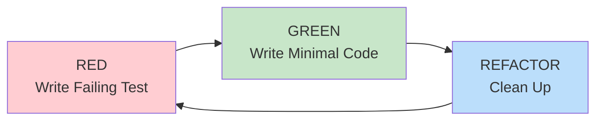

# TDD Workflow for Go Projects

Test-Driven Development (TDD) is MANDATORY for all Go code. This document defines the workflow and patterns.

## Testing Framework (NON-NEGOTIABLE)

**All tests MUST use [testify](https://github.com/stretchr/testify):**
- `require` for fatal assertions (stops test on failure)
- `assert` for non-fatal assertions (continues test)
- `mock` package for mock generation
- **Exception**: Kubernetes e2e tests may use k8s e2e framework

## The TDD Cycle



### 1. RED: Write a Failing Test

```go
import (
    "testing"
    "github.com/stretchr/testify/assert"
    "github.com/stretchr/testify/require"
)

func TestUserService_CreateUser(t *testing.T) {
    repo := newMockUserRepo()
    svc := application.NewUserService(repo)

    user, err := svc.CreateUser(context.Background(), "test@example.com", "Test User")

    require.NoError(t, err)
    assert.Equal(t, "test@example.com", user.Email)
}
```

**Run the test and confirm it FAILS for the right reason.**

### 2. GREEN: Write Minimal Code to Pass

```go
func (s *userService) CreateUser(ctx context.Context, email, name string) (*domain.User, error) {
    user := &domain.User{
        Email: email,
        Name:  name,
    }
    return user, nil
}
```

**Run the test and confirm it PASSES.**

### 3. REFACTOR: Clean Up While Green

```go
func (s *userService) CreateUser(ctx context.Context, email, name string) (*domain.User, error) {
    user, err := domain.NewUser(email, name)
    if err != nil {
        return nil, fmt.Errorf("create user: %w", err)
    }

    if err := s.repo.Save(ctx, user); err != nil {
        return nil, fmt.Errorf("save user: %w", err)
    }

    return user, nil
}
```

**Run tests after each change to ensure they still pass.**

---

## 6-Step TDD Workflow

For each feature or bugfix, follow these steps:

### Step 1: INVESTIGATE

- Understand the requirement thoroughly
- Review existing code and related modules
- Identify dependencies and potential side effects
- Document acceptance criteria

### Step 2: PLAN (features) / REPRODUCE (bugs)

**For features:**
- Design the interface/API BEFORE implementation
- Identify edge cases and error scenarios
- Plan test scenarios

**For bugs:**
- Create a minimal reproduction case
- Write a failing test that demonstrates the bug

### Step 3: TEST (RED)

- Write failing tests FIRST
- Use AAA pattern (Arrange, Act, Assert)
- Include positive and negative test cases
- Test edge cases and error handling
- **RUN TESTS - confirm they FAIL**

### Step 4: IMPLEMENT (GREEN)

- Write MINIMAL code to pass the test
- Follow SOLID principles
- Keep functions small and focused
- **RUN TESTS - confirm they PASS**

### Step 5: VALIDATE

- Run ALL tests to ensure no regressions
- Check code coverage
- Run linter
- Review error handling

### Step 6: REFACTOR

- Clean up for clarity and maintainability
- Remove dead code
- **RUN TESTS - ensure still green**

---

## Test Patterns

### Table-Driven Tests (with testify)

```go
import (
    "testing"
    "github.com/stretchr/testify/require"
)

func TestValidateEmail(t *testing.T) {
    tests := []struct {
        name    string
        email   string
        wantErr bool
    }{
        {"valid email", "user@example.com", false},
        {"valid with subdomain", "user@mail.example.com", false},
        {"empty email", "", true},
        {"no at sign", "userexample.com", true},
        {"no domain", "user@", true},
        {"no local part", "@example.com", true},
    }

    for _, tt := range tests {
        t.Run(tt.name, func(t *testing.T) {
            err := ValidateEmail(tt.email)
            if tt.wantErr {
                require.Error(t, err)
            } else {
                require.NoError(t, err)
            }
        })
    }
}
```

### Subtests for Organization

```go
func TestUserService(t *testing.T) {
    t.Run("CreateUser", func(t *testing.T) {
        t.Run("success", func(t *testing.T) {
            // test success case
        })
        t.Run("duplicate email", func(t *testing.T) {
            // test duplicate error
        })
        t.Run("invalid email", func(t *testing.T) {
            // test validation error
        })
    })

    t.Run("GetUser", func(t *testing.T) {
        t.Run("found", func(t *testing.T) {
            // test found case
        })
        t.Run("not found", func(t *testing.T) {
            // test not found error
        })
    })
}
```

### AAA Pattern (with testify)

```go
import (
    "testing"
    "github.com/stretchr/testify/assert"
)

func TestCalculateTotal(t *testing.T) {
    // Arrange
    cart := NewCart()
    cart.AddItem(Item{Name: "Widget", Price: 10.00, Qty: 2})
    cart.AddItem(Item{Name: "Gadget", Price: 25.00, Qty: 1})

    // Act
    total := cart.CalculateTotal()

    // Assert
    assert.Equal(t, 45.00, total)
}
```

### Test Helpers

```go
func TestUserHandler(t *testing.T) {
    handler, cleanup := setupTestHandler(t)
    defer cleanup()

    // ... test code
}

func setupTestHandler(t *testing.T) (*UserHandler, func()) {
    t.Helper()

    repo := newMockUserRepo()
    svc := application.NewUserService(repo)
    handler := NewUserHandler(svc)

    cleanup := func() {
        // cleanup resources
    }

    return handler, cleanup
}
```

---

## Mocking Strategies

### Interface-Based Mocks

```go
// Port interface
type UserRepository interface {
    FindByID(ctx context.Context, id string) (*domain.User, error)
    Save(ctx context.Context, user *domain.User) error
}

// Mock implementation
type mockUserRepo struct {
    users map[string]*domain.User
}

func newMockUserRepo() *mockUserRepo {
    return &mockUserRepo{users: make(map[string]*domain.User)}
}

func (m *mockUserRepo) FindByID(ctx context.Context, id string) (*domain.User, error) {
    if user, ok := m.users[id]; ok {
        return user, nil
    }
    return nil, domain.ErrUserNotFound
}

func (m *mockUserRepo) Save(ctx context.Context, user *domain.User) error {
    m.users[user.ID] = user
    return nil
}
```

### Function-Based Mocks

```go
type mockEmailSender struct {
    SendFunc func(to, subject, body string) error
}

func (m *mockEmailSender) Send(to, subject, body string) error {
    if m.SendFunc != nil {
        return m.SendFunc(to, subject, body)
    }
    return nil
}

// Usage in test (with testify)
func TestNotifyUser(t *testing.T) {
    var sentTo string
    sender := &mockEmailSender{
        SendFunc: func(to, subject, body string) error {
            sentTo = to
            return nil
        },
    }

    notifier := NewNotifier(sender)
    notifier.NotifyUser("user@example.com", "Hello")

    assert.Equal(t, "user@example.com", sentTo)
}
```

---

## Testing Anti-Patterns

### Never Test Mock Behavior

```go
// BAD - Testing the mock, not the code
func TestBad(t *testing.T) {
    mock := &mockRepo{}
    svc := NewService(mock)

    svc.DoSomething()

    if !mock.CalledWith("expected") {  // Testing mock!
        t.Fatal("mock not called correctly")
    }
}

// GOOD - Test actual behavior (with testify)
func TestGood(t *testing.T) {
    mock := &mockRepo{}
    svc := NewService(mock)

    result, err := svc.DoSomething()

    require.NoError(t, err)
    assert.Equal(t, "success", result.Status)  // Testing real outcome
}
```

### Never Add Test-Only Methods to Production

```go
// BAD - Test pollution
type Cache struct {
    data map[string]interface{}
}

func (c *Cache) Reset() {  // Only used in tests!
    c.data = make(map[string]interface{})
}

// GOOD - Test utilities in test package
func cleanupCache(t *testing.T, c *Cache) {
    t.Helper()
    // Access via test-specific mechanism
}
```

### Mock Gate Function

Before mocking any method, ask:
1. What side effects does the real method have?
2. Does this test depend on those side effects?
3. Do I fully understand what this test needs?

If depends on side effects: Mock at LOWER level, not the method test depends on.

---

## Quality Gates

Before considering any task complete:

```bash
# All must pass
task build
task test
task lint
go-arch-lint check   # if config exists
```

### Coverage Goals

- New code: 80%+ coverage
- Critical paths: 100% coverage
- Edge cases: Covered by specific tests

### Race Detection

Always run tests with race detector in CI:

```bash
go test -race ./...
```
