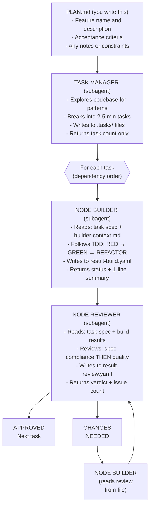

# Node Team - Coordinated Agent Workflow

## EXECUTION INSTRUCTIONS

**Follow the orchestration procedure in `references/orchestration.md`.**

**DO NOT read** `references/builder-context.md`, `references/reviewer-context.md`, or `references/examples.md`. Those are read by subagents only.

---

## Overview

The Node Team skill implements features you define. You provide the WHAT (feature spec), it handles the HOW (implementation).



### Context-Saving Design

All subagents communicate via `.tasks/` files. The orchestrator never reads
source code or detailed results - it only tracks status and dispatches agents.
This keeps the orchestrator's context lean across many tasks.

## Invocation

```bash
# Use default PLAN.md in current directory
/node-team

# Specify a different plan file
/node-team plan="docs/features/user-auth.md"

# Implement only a specific task (after initial planning)
/node-team task=3
```

## Arguments

| Argument | Default | Description |
|----------|---------|-------------|
| `plan` | `PLAN.md` | Path to the plan file containing feature specification |
| `task` | (all) | Specific task number to implement (optional) |

---

## Plan File Format (PLAN.md) - BDD/Gherkin

The plan file uses **BDD (Behavior-Driven Development)** format with Gherkin syntax.
This provides executable specifications that map directly to tests.

```gherkin
Feature: [Short descriptive name]
  As a [role/persona]
  I want [capability]
  So that [benefit]

  Background:
    Given [common precondition for all scenarios]

  Scenario: [Specific behavior being tested]
    Given [initial context/state]
    And [additional context]
    When [action taken]
    And [additional action]
    Then [expected outcome]
    And [additional outcome]

  Scenario: [Another behavior]
    Given [context]
    When [action]
    Then [outcome]

  # Optional: Notes section for implementation hints
  # Note: Use existing user model from src/components/users/
  # Note: JWT secret should come from config
```

### Gherkin Keywords

| Keyword | Purpose |
|---------|---------|
| `Feature:` | High-level description of the capability |
| `As a / I want / So that` | User story format (optional but recommended) |
| `Background:` | Steps run before each scenario |
| `Scenario:` | Specific testable behavior |
| `Given` | Precondition/initial state |
| `When` | Action being performed |
| `Then` | Expected outcome |
| `And` / `But` | Additional steps (continues previous keyword type) |

---

## Agents and Their Context

Each agent is a subagent dispatched via the Task tool. The orchestrator does NOT read these files - subagents read their own context.

| Agent | Role | Context File |
|-------|------|--------------|
| **Task Manager** | Parses plan, explores codebase, creates task breakdown | (explores codebase directly) |
| **Node Builder** | Implements tasks following TDD, component architecture | `references/builder-context.md` |
| **Node Reviewer** | Combined review: spec compliance + code quality in one pass | `references/reviewer-context.md` |

See `references/orchestration.md` for exact dispatch templates and the coordination loop.

---

## Anti-Patterns

- Orchestrator reading source code, result files, or reference files (subagents do this)
- Orchestrator echoing or summarizing full subagent output (wastes context)
- Inlining plan content into dispatch prompts (reference by file path instead)
- Dispatching multiple builders in parallel (causes conflicts)
- Proceeding with CHANGES_NEEDED status
- Ignoring security vulnerabilities
- Marking task complete with failing tests/lint

---

## Integration with Other Skills

- **planner**: Can be used to create the initial plan that Task Manager refines
- **prd/rfc**: Use these to write the feature specification before implementing
