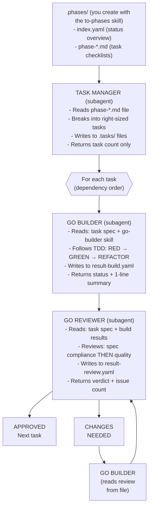

# Go Team - Coordinated Agent Workflow

## EXECUTION INSTRUCTIONS

**Follow the orchestration procedure in `references/orchestration.md`.**

**DO NOT read** `references/examples.md` or the sibling `go-builder`/`go-reviewer` skills. Those are read by subagents only.

---

## Overview

The Go Team skill implements features you define. You provide the WHAT (plan phases), it handles the HOW (implementation).



### Context-Saving Design

All subagents communicate via `.tasks/` files. The orchestrator only reads
`.phases/index.yaml` for status - never source code or detailed results.
This keeps the orchestrator's context lean across many tasks and phases.

## Invocation

Invoke this skill by name (`go-team`). It accepts two optional arguments; how they
are passed depends on the agent host:

- (no arguments) — work on the current phase from `.phases/index.yaml`
- `phase=<N>` — work on a specific phase number
- `task=<N>` — implement only a specific task (after initial planning)

### Model Assignment (Recommended)

The orchestrator only reads status files and dispatches subagents - it doesn't write
code. When the host supports per-agent model selection, run the orchestrator and Task
Manager on a cheaper/faster model and give the Builder and Reviewer a stronger model
for implementation:

- Orchestrator: cheaper/faster model (session model)
- Task Manager: cheaper/faster model
- Builder: strongest available coding model
- Reviewer: strongest available coding model

## Arguments

| Argument | Default | Description |
|----------|---------|-------------|
| `phase` | (current) | Specific phase number from `.phases/index.yaml` |
| `task` | (all) | Specific task number to implement (optional) |

---

## Phase Structure (.phases/)

Phases are created with the `to-phases` skill and stored in `.phases/`:

```
.phases/
├── index.yaml              # Lean status (orchestrator reads ONLY this)
├── phase-01-project-setup.md
├── phase-02-core-domain.md
└── ...
```

### index.yaml (Orchestrator reads this)

```yaml
project: "my-project"
current_phase: 2
phases:
  - id: 1
    name: "Project Setup"
    file: "phase-01-project-setup.md"
    status: completed
    progress: "4/4"
  - id: 2
    name: "Core Domain & Ports"
    file: "phase-02-core-domain.md"
    status: in_progress
    progress: "3/8"
```

### phase-*.md (Task Manager reads these)

```markdown
# Phase 2: Core Domain & Ports

## Tasks

- [x] Define `domain/command.go` (Command, CommandSpec types)
- [x] Define `domain/result.go` (ParseResult type)
- [ ] Define `ports/runner.go` (CommandRunner interface)
- [ ] Add unit tests for domain types

## Notes

- Follow hexagonal architecture
- Domain types should have no external dependencies
```

---

## Agents and Their Context

Each agent is a subagent dispatched by the orchestrator. The orchestrator does NOT read these files - subagents read their own context.

| Agent | Role | Skill it reads |
|-------|------|----------------|
| **Task Manager** | Parses phase file, explores codebase, creates task breakdown | `.phases/phase-*.md` directly |
| **Go Builder** | Implements tasks following TDD, hex architecture | `go-builder` skill (which references `golang`) |
| **Go Reviewer** | Combined review: spec compliance + code quality in one pass | `go-reviewer` skill (which references `go-code-review` and `golang`) |

See `references/orchestration.md` for exact dispatch templates and the coordination loop.
See `references/examples.md` for worked usage examples.

---

## Related Skills

`go-team` is orchestration only. Everything else lives in sibling skills:

| Skill                | Purpose                                                                    |
|----------------------|----------------------------------------------------------------------------|
| **`go-builder`**     | Team-workflow builder skill — TDD loop, Cobra/Viper/testify rules, `result-*-build.yaml` schema |
| **`go-reviewer`**    | Team-workflow reviewer skill — two-stage review, verdict, `result-*-review.yaml` schema |
| **`golang`**         | Language idioms, TDD workflow, hexagonal architecture, code patterns |
| **`go-code-review`** | 100+ Go mistake patterns, semantic dead code review, review checklist |

The Go Builder subagent reads `go-builder` (which references `golang`). The Go Reviewer subagent reads `go-reviewer` (which references `go-code-review`).

---

## Anti-Patterns

- Orchestrator reading source code, result files, or reference files (subagents do this)
- Orchestrator reading `.phases/phase-*.md` files (Task Manager does this)
- Orchestrator echoing or summarizing full subagent output (wastes context)
- Inlining phase content into dispatch prompts (reference by file path instead)
- Dispatching multiple builders in parallel (causes conflicts)
- Proceeding with CHANGES_NEEDED status
- Ignoring architecture violations
- Marking task complete with failing tests/lint

---

## Integration with Other Skills

- **planner**: Use the `to-phases` skill to create the `.phases/` structure before running the `go-team` skill
- **go-code-review**: Go Team follows a similar review pattern
