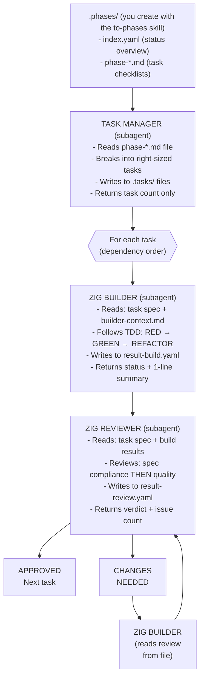

# Zig Team - Coordinated Agent Workflow

## EXECUTION INSTRUCTIONS

**Follow the orchestration procedure in `references/orchestration.md`.**

**DO NOT read** `references/examples.md` or the sibling `zig-builder`/`zig-reviewer` skills. Those are read by subagents only.

---

## Overview

The Zig Team skill implements features you define. You provide the WHAT (plan phases), it handles the HOW (implementation). All Zig projects follow hexagonal architecture (ports and adapters) with compile-time boundary enforcement via `build.zig` modules.



### Context-Saving Design

All subagents communicate via `.tasks/` files. The orchestrator only reads
`.phases/index.yaml` for status - never source code or detailed results.
This keeps the orchestrator's context lean across many tasks and phases.

## Invocation

Invoke this skill by name (`zig-team`). It accepts two optional arguments; how they
are passed depends on the agent host:

- (no arguments) — work on the current phase from `.phases/index.yaml`
- `phase=<N>` — work on a specific phase number
- `task=<N>` — implement only a specific task (after initial planning)

### Model Assignment (Recommended)

The orchestrator only reads status files and dispatches subagents - it doesn't write
code. When the host supports per-agent model selection, run the orchestrator and Task
Manager on a cheaper/faster model and give the Builder and Reviewer a stronger model
for implementation:

- Orchestrator: cheaper/faster model (session model)
- Task Manager: cheaper/faster model
- Builder: strongest available coding model
- Reviewer: strongest available coding model


## Arguments

| Argument | Default | Description |
|----------|---------|-------------|
| `phase` | (current) | Specific phase number from `.phases/index.yaml` |
| `task` | (all) | Specific task number to implement (optional) |

---

## Phase Structure (.phases/)

Phases are created with the `to-phases` skill and stored in `.phases/`:

```
.phases/
├── index.yaml              # Lean status (orchestrator reads ONLY this)
├── phase-01-project-setup.md
├── phase-02-core-modules.md
└── ...
```

### index.yaml (Orchestrator reads this)

```yaml
project: "my-zig-project"
current_phase: 2
phases:
  - id: 1
    name: "Project Setup"
    file: "phase-01-project-setup.md"
    status: completed
    progress: "4/4"
  - id: 2
    name: "Core Modules"
    file: "phase-02-core-modules.md"
    status: in_progress
    progress: "3/8"
```

### phase-*.md (Task Manager reads these)

```markdown
# Phase 2: Core Modules

## Tasks

- [x] Define parser interface in src/parser.zig
- [x] Implement tokenizer with comptime lookup
- [ ] Add error handling with error unions
- [ ] Write tests for parser edge cases

## Notes

- Use comptime for lookup tables where possible
- Allocator should be passed explicitly
- Follow Zig style guide for naming
```

---

## Related Skills

`zig-team` is orchestration only. Everything else lives in sibling skills:

| Skill                 | Purpose                                                                    |
|-----------------------|----------------------------------------------------------------------------|
| **`zig-builder`**     | Team-workflow builder skill — TDD loop, focused-test parallelism, `result-*-build.yaml` schema |
| **`zig-reviewer`**    | Team-workflow reviewer skill — four-stage review, verdict, `result-*-review.yaml` schema |
| **`zig`**             | Language idioms, TDD, hexagonal architecture, `build.zig` module boundaries, testing patterns |
| **`zig-code-review`** | Memory safety, resource leaks, allocator misuse, architecture violations, semantic dead code |

The Zig Builder subagent reads `zig-builder` (which references `zig`). The Zig Reviewer subagent reads `zig-reviewer` (which references `zig-code-review`).

---

## Architecture Rules (Quick Reference)

Non-negotiable — details and enforcement live in the `zig` skill:

- Dependencies flow INWARD: adapters → app → ports → domain
- Domain has NO external dependencies (no `std.net`, no `std.fs`, no `@cImport`)
- Layer boundaries are enforced at compile time via `build.zig` module isolation
- Prefer comptime generics for ports; vtable only when runtime polymorphism is needed
- All adapters with resources MUST have explicit `init()` / `deinit()` lifecycle

---

## Agents and Their Context

Each agent is a subagent dispatched by the orchestrator. The orchestrator does NOT read these files - subagents read their own context.

| Agent | Role | Skill it reads |
|-------|------|----------------|
| **Task Manager** | Parses phase file, explores codebase, creates task breakdown | `.phases/phase-*.md` directly |
| **Zig Builder** | Implements tasks following TDD, hexagonal architecture, Zig best practices | `zig-builder` skill (which references `zig`) |
| **Zig Reviewer** | Combined review: spec + architecture + code quality + dead code | `zig-reviewer` skill (which references `zig-code-review`) |

See `references/orchestration.md` for exact dispatch templates and the coordination loop.
See `references/examples.md` for worked usage examples.

---

## Anti-Patterns

- Orchestrator reading source code, result files, or reference files (subagents do this)
- Orchestrator reading `.phases/phase-*.md` files (Task Manager does this)
- Orchestrator echoing or summarizing full subagent output (wastes context)
- Inlining phase content into dispatch prompts (reference by file path instead)
- Dispatching multiple builders in parallel (causes conflicts)
- Proceeding with CHANGES_NEEDED status
- Ignoring memory safety issues
- Marking task complete with failing tests
- Putting business logic in adapters (adapters only translate between external formats and domain types)
- Importing std.net, std.fs, or C libraries in domain layer
- Modifying `build.zig` to add cross-layer imports without architectural review

---

## Integration with Other Skills

- **`zig`**: Language, architecture, testing — read by the Zig Builder
- **`zig-code-review`**: Pattern reference + Dead Code Review — read by the Zig Reviewer
- **`to-phases`**: Create the `.phases/` structure before running `zig-team`
- **`prd`/`rfc`**: Write the feature specification before implementing
